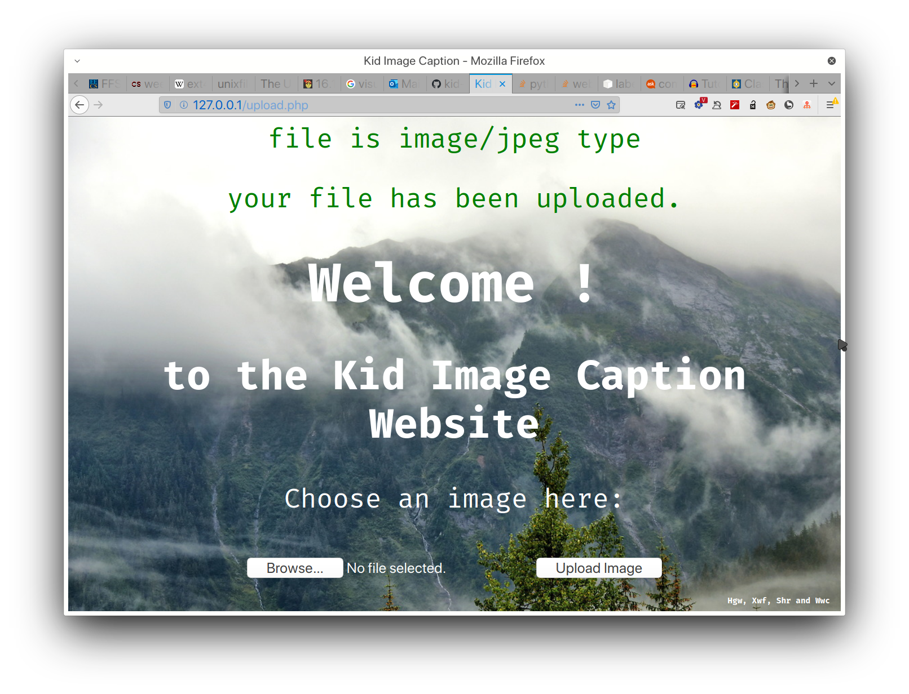

## this part is responsible with hgw
### this part provides functions:
* a well-designed interface for users
* provide a button to upload image and show the processed image, play the speak-up
* call functions in the model and speak-up folder
Notice this part is used for final presentation so it should be made as fluent and elegant

### functions that can be used
* upload an image to a local folder with a given maximum size through a webpage running on local ip. If you wanna run on a server, server is needed. The webpage is designed with proper interaction and interface.

### meanings of the files
* upload.php this file need to create uploads/ directory as its firtst line targetdir is uploads/ which is the directory where the uploaded pictures will go. If you wanna see how it goes in your computer environment, please:
  - install php on your computer. You may search a tutorial online and the final result is to put your test.php file in the directory set for php when you installed 
  php, type **http://127.0.0.1/test.php** in your favorite browser address bar and you see the execition result, then read steps below.
  - put upload.php and mountain.jpg in the directory where you put test.php, make a directory called uploads, type **http://127.0.0.1/upload.php** and choose pictures to upload. If you see the hint that you have been uploaded the pic, you can find picture in the uploads folder you created just now.
  - if the result doesnt go like what i said. You may check pip.ini file. pip.ini is a file for php initialize settings, it's a file created when you installed php.
  
    you may find where the file is through online search, according to you operating system. In pip.ini, search file_upload and max_file_upload_size(usually 2M so you can also search 2M to find its position), change file_upload to be on and change max file upload size to a proper size if you want to upload a larger size picture. Turn these two to a right status and try again. 
 
    If it still doesn't work, you may check the uploads folder's privilege. You need to change it to be able to written by other users. Use shell command **chmod o+w uploads** to finish this.
  
    If anymore issues existing for you, send me issues.
  - this is how it works:
  
  
     
     
     
     
